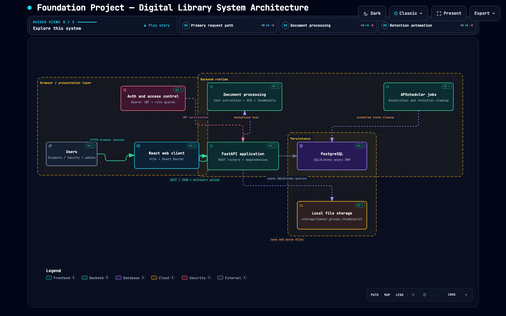

# BÁO CÁO DỰ ÁN
## Hệ thống Quản lý Tài liệu Cá nhân & Nhóm (Personal & Group Document Management)

---
### Để hiểu về dự án bạn hãy đọc mô tả tại đây: [Mô tả dự án](MoTaDuAn.MD)

## 1. Thông tin sinh viên

| Mục | Nội dung |
|---|---|
| **Họ và tên** | `[Họ tên sinh viên]` |
| **MSSV** | `[Mã số sinh viên]` |
| **Lớp** | `[Lớp]` |
| **Khoa** | `[Khoa]` |
| **GVHD** | `[Giảng viên hướng dẫn]` |
| **Học kỳ / Năm học** | `[Học kỳ - Năm học]` |
| **Tên đề tài** | Hệ thống Quản lý Tài liệu Cá nhân & Nhóm |
| **Công nghệ chính** | FastAPI + PostgreSQL + React + Vite + TypeScript + TailwindCSS |

---

## 2. Tổng quan kiến trúc

---

## 3. Danh sách chức năng đã xây dựng

### 3.1. Backend (FastAPI + PostgreSQL)

#### 3.1.1. Hệ thống xác thực & người dùng
- Đăng nhập bằng MSSV / email / username + JWT token
- Lấy thông tin user hiện tại (`/auth/me`)
- Cập nhật thông tin cá nhân, đổi mật khẩu
- **Refresh token & auto logout khi hết hạn**
- **Middleware kiểm tra quyền admin cho route quản trị**
- **Validate mật khẩu mạnh (độ dài, ký tự đặc biệt)**
- **Ghi log đăng nhập (thời gian, IP, user-agent)**

#### 3.1.2. Tài liệu cá nhân
- Upload tài liệu (nhiều định dạng: PDF, DOCX, PPTX, ZIP, XLSX, TXT, ảnh…) 
---
**Tại đây sinh viên lựa chọn giải pháp như sau**: đối với ảnh, trong quá trình học tập, sinh viên thường xuyên chụp ảnh bài giảng để lưu trữ bài học, nên í tưởng lưu trữ của dạng tài liệu này là khi upload danh sách ảnh (nhiều hơn một ảnh) thì chương trình sẽ gộp thành một file PDF để sau này chương trình sẽ dùng **OCR** để convert thành text để lưu trữ một cách thân thiện và hữu ích khi dùng các tính năng liên quan tới văn bản sau này.
---
- Tính SHA-256 checksum chống upload trùng lặp
- Xem danh sách tài liệu có phân trang và sắp xếp (theo tên, ngày, kích thước)
- Xem chi tiết tài liệu
- Cập nhật metadata (tiêu đề, mô tả, danh mục, JSONB tác giả/số trang/năm)
- Xóa mềm (soft delete) — đưa vào thùng rác
- Khôi phục tài liệu từ thùng rác
- Tự động xóa vĩnh viễn sau 30 ngày
- Full-text search tiếng Việt (PostgreSQL `tsvector` + `unaccent` + `pg_trgm`)
- Trigger tự động cập nhật `search_vector` khi thêm/sửa tài liệu
- GIN index tối ưu tốc độ tìm kiếm
- Quản lý phiên bản tài liệu (`document_versions`)
- Ghi chú cá nhân gắn vào tài liệu (`notes`)
- Đánh dấu yêu thích (`favorites`)
- Nhật ký tải xuống/xem (`download_logs`)
- Xử lý nền (OCR, thumbnail) qua `processing_jobs`
- **Tải xuống tài liệu (stream file, kiểm tra quyền)**
- **Xem trước PDF/ảnh trực tiếp trên trình duyệt**
- **Chia sẻ tài liệu qua link tạm thời (public link có thời hạn)**
- **Thống kê dung lượng đã dùng / hạn mức**

#### 3.1.3. Folder & Tag
- CRUD folder cá nhân (tạo, đổi tên, màu, xóa)
- Folder chứa nhiều tag, tag có thể thuộc nhiều folder (many-to-many qua `folder_tags`)
- Tự động tạo 4 folder mặc định khi đăng ký: Giáo trình, Bài tập, Tài liệu tham khảo, Đồ án tốt nghiệp
- CRUD tag cá nhân (tên, màu, phân cấp `parent_id`)
- Gán/gỡ tag cho tài liệu
- Gán/gỡ tag cho folder
- Hiển thị tài liệu theo folder (lọc qua quan hệ folder → tag → document)
- Thêm thư mục mới với chọn tag có sẵn hoặc tạo tag mới
- **Sắp xếp folder theo tên / ngày tạo / số lượng tài liệu**
- **Di chuyển tài liệu giữa các folder**
- **Kéo thả tài liệu vào folder (frontend + API move)**

#### 3.1.4. Nhóm (Workspace)
- Tạo nhóm, đặt tên, mô tả, chọn quyền mặc định (view/full)
- Danh sách nhóm đang tham gia (kèm role, số thành viên, thời gian cập nhật)
- Xem chi tiết nhóm
- Cập nhật thông tin nhóm (owner)
- Giải tán nhóm với thông báo trước 24h
- Mời thành viên theo MSSV/email/username
- Chấp nhận/từ chối lời mời
- Quản lý danh sách thành viên (xem, đổi quyền, xóa)
- Chuyển quyền owner cho thành viên khác
- Rời nhóm
- Upload tài liệu trực tiếp vào nhóm (yêu cầu quyền full)
- Danh sách tài liệu trong nhóm (có phân trang, lọc theo folder)
- Xóa tài liệu trong nhóm (soft delete, thùng rác riêng của nhóm)
- Khôi phục tài liệu từ thùng rác nhóm
- Chia sẻ tài liệu cá nhân vào nhóm (nhân bản file vật lý)
- Chia sẻ cả folder cá nhân vào nhóm (snapshot tại thời điểm đó)
- Lưu tài liệu nhóm về kho cá nhân (nhân bản, tự tạo tag thiếu)
- Folder trong nhóm (dùng chung bảng `folders` với `workspace_id`)
- Thùng rác riêng của từng nhóm (chỉ owner thấy)
- Phân quyền tầng DB (kiểm tra `workspace_members` mọi endpoint)
- Background job giải tán nhóm sau 24h (APScheduler)
- Background job xóa orphaned documents sau 10 ngày
- Background job xóa thùng rác sau 30 ngày
- **Gửi lời mời hàng loạt (nhiều MSSV cùng lúc)**
- **Hủy lời mời đã gửi (trước khi được chấp nhận)**
- **Xem lịch sử hoạt động nhóm (audit log)**
- **Thông báo real-time khi có thành viên mới / tài liệu mới (polling hoặc SSE)**

#### 3.1.5. Thông báo
- Tạo thông báo khi: được mời vào nhóm, có người chấp nhận lời mời, nhóm sắp giải tán
- **Đánh dấu đã đọc / chưa đọc**
- **Đếm số thông báo chưa đọc (badge trên Header)**
- **Xóa thông báo**
- **Lọc thông báo theo loại (invite / accept / dissolve / system)**

#### 3.1.6. PostgreSQL nâng cao (trọng tâm đề tài)
- Extension `unaccent` + `pg_trgm` cho full-text search tiếng Việt
- `tsvector` / `tsquery` cho tìm kiếm văn bản
- GIN index trên `search_vector`
- Trigger PL/pgSQL tự động cập nhật `search_vector`
- `JSONB` lưu metadata linh hoạt (tác giả, số trang, năm…)
- Soft delete pattern (`is_deleted`, `deleted_at`)
- Self-reference trong `categories`, `tags` (phân cấp cây)
- Many-to-many qua bảng trung gian (`document_tags`, `folder_tags`)
- Phân trang chuẩn (`LIMIT`/`OFFSET`)
- Window function (`COUNT OVER PARTITION BY`) trong list groups
- `selectinload` tối ưu N+1 query
- **Index composite cho truy vấn thường dùng (`user_id + is_deleted`, `workspace_id + is_deleted`)**
- **Partial index cho tài liệu chưa xóa**
- **Materialized view thống kê (tùy chọn)**
- **Row-level security (RLS) ở mức cơ bản cho workspace**

---

### 3.2. Frontend (React + Vite + TypeScript + TailwindCSS)

#### 3.2.1. Hệ thống & Layout
- Cấu trúc thư mục chuẩn (`pages/`, `components/`, `services/`, `types/`, `stores/`, `utils/`)
- Path alias `@/` cho toàn bộ import
- `MainLayout` (Sidebar + Header + Outlet) dùng chung mọi trang
- `AuthLayout` riêng cho trang đăng nhập
- Protected Routes (chặn route khi chưa đăng nhập)
- Role-based route (admin-only routes)
- Khôi phục session khi F5 (gọi `/auth/me` kiểm tra token)
- Spinner "Đang khởi động..." khi đang restore session
- **Dark mode (tùy chọn)**
- **Responsive layout (mobile / tablet / desktop)**
- **Error boundary cho toàn app**
- **404 page & 403 page**

#### 3.2.2. Component dùng chung
- `Button` (variant: primary/outline/ghost/danger, size, icon)
- `Input` (có icon trái, validate, hiển thị lỗi)
- `Badge` (variant: primary/success/default/danger)
- `Avatar` (fallback chữ cái đầu tên)
- `Card` (khung chuẩn)
- `Dropdown` / Context menu (item có icon, hỗ trợ `danger`)
- `Tag` (pill có nút xóa)
- `ProgressBar`
- `EmptyState` (icon + tiêu đề + mô tả + nút CTA)
- `Toast` (success/error/info, tự đóng 3s, zustand store)
- `Sidebar` (NavLink active theo route, badge số thông báo)
- `Header` (search bar, badge phạm vi, chuông thông báo, avatar)
- `FileIcon` (map mime type → icon + màu theo loại file)
- `DocumentRow` (dòng danh sách)
- `DocumentCard` (card lưới)
- `FolderCard`
- `DocumentContextMenu`
- `StatCard`
- `TagDistribution`
- `ProcessingDonut` (recharts)
- `PermissionBadge`
- `ProtectedRoute`
- **`Modal` / `Dialog` dùng chung**
- **`ConfirmDialog` cho hành động nguy hiểm**
- **`Skeleton` loading placeholder**
- **`Pagination` component**
- **`SearchBar` với debounce**
- **`FileUploader` (drag & drop, progress)**
- **`Tooltip`**
- **`Tabs` component**

#### 3.2.3. Trang đã xây dựng
- `LoginPage` (form đăng nhập, validate, toggle mật khẩu, redirect theo role)
- `PersonalDashboard` (4 stat card, tài liệu gần đây, donut chart, phân bổ tag)
- `PersonalDocuments` (folder grid, document grid, filter bar, tabs loại file, phân trang)
- `DocumentDetail` (tabs Chi tiết/Mô tả/Ghi chú/Hoạt động, sidebar thông tin, các action)
- `TrashPage` (phân loại theo nguồn gốc: cá nhân vs từ nhóm giải tán, đếm ngược 30 ngày)
- `SettingsPage` (thông tin cá nhân, đổi mật khẩu)
- `GroupList` (danh sách nhóm, badge role, modal tạo nhóm)
- `GroupSpace` (5 tab: Tài liệu/Thành viên/Yêu cầu/Cài đặt/Thùng rác, phân quyền hiển thị theo role)
- **`RegisterPage` (đăng ký tài khoản)**
- **`SearchPage` (tìm kiếm toàn cục, filter nâng cao)**
- **`FavoritesPage` (tài liệu yêu thích)**
- **`SharedWithMePage` (tài liệu được chia sẻ)**
- **`NotificationsPage` (danh sách thông báo đầy đủ)**
- **`ProfilePage` (xem/sửa thông tin cá nhân)**
- **`AdminDashboard` (nếu có role admin)**
- **`NotFoundPage` (404)**

#### 3.2.4. State & Services
- `authStore` (zustand + persist localStorage: token, user, isAuthenticated)
- `notificationStore` (zustand: danh sách toast)
- `api.ts` (axios instance, interceptor gắn token, auto logout khi 401)
- `authService` (login, getMe, logout)
- `documentService` (getAll, getById, upload, update, delete, phân trang)
- `folderService` (CRUD folder, gán/gỡ tag)
- `tagService` (getAll, create)
- `groupService` (đầy đủ 20+ method cho mọi tính năng nhóm)
- `notificationService`
- **`uploadService` (upload nhiều file, progress, retry)**
- **`searchService` (full-text search, gợi ý)**
- **`favoriteService`**
- **`noteService`**
- **`versionService`**
- **`trashService` (khôi phục, xóa vĩnh viễn)**
- **Custom hooks: `useDebounce`, `usePagination`, `useAuth`, `useToast`**

---
---
# DANH SÁCH CHỨC NĂNG ĐÃ XÂY DỰNG

## Quy ước mã STT

| Tiền tố | Ý nghĩa |
|---|---|
| `BE` | Backend |
| `FE` | Frontend |
| `DB` | PostgreSQL nâng cao |

> **Sinh viên thực hiện:** Cao Khôi Nguyên
> **Mức độ hoàn thành:** Tốt

---

## 3.1. Backend (FastAPI + PostgreSQL)

### 3.1.1. Hệ thống xác thực & người dùng

| STT | Tên task | Tên | Mức độ hoàn thành |
|---|---|---|---|
| 001BE | Đăng nhập bằng MSSV / email / username + JWT token | Cao Khôi Nguyên | Tốt |
| 002BE | Lấy thông tin user hiện tại (`/auth/me`) | Cao Khôi Nguyên | Tốt |
| 003BE | Cập nhật thông tin cá nhân, đổi mật khẩu | Cao Khôi Nguyên | Tốt |
| 004BE | Refresh token & auto logout khi hết hạn | Cao Khôi Nguyên | Tốt |
| 005BE | Middleware kiểm tra quyền admin cho route quản trị | Cao Khôi Nguyên | Tốt |
| 006BE | Validate mật khẩu mạnh (độ dài, ký tự đặc biệt) | Cao Khôi Nguyên | Tốt |
| 007BE | Ghi log đăng nhập (thời gian, IP, user-agent) | Cao Khôi Nguyên | Tốt |

### 3.1.2. Tài liệu cá nhân

| STT | Tên task | Tên | Mức độ hoàn thành |
|---|---|---|---|
| 008BE | Upload tài liệu (nhiều định dạng: PDF, DOCX, PPTX, ZIP, XLSX, TXT, ảnh…) | Cao Khôi Nguyên | Tốt |
| 009BE | Gộp nhiều ảnh thành một file PDF khi upload danh sách ảnh (phục vụ OCR sau này) | Cao Khôi Nguyên | Tốt |
| 010BE | Tính SHA-256 checksum chống upload trùng lặp | Cao Khôi Nguyên | Tốt |
| 011BE | Xem danh sách tài liệu có phân trang và sắp xếp (theo tên, ngày, kích thước) | Cao Khôi Nguyên | Tốt |
| 012BE | Xem chi tiết tài liệu | Cao Khôi Nguyên | Tốt |
| 013BE | Cập nhật metadata (tiêu đề, mô tả, danh mục, JSONB tác giả/số trang/năm) | Cao Khôi Nguyên | Tốt |
| 014BE | Xóa mềm (soft delete) — đưa vào thùng rác | Cao Khôi Nguyên | Tốt |
| 015BE | Khôi phục tài liệu từ thùng rác | Cao Khôi Nguyên | Tốt |
| 016BE | Tự động xóa vĩnh viễn sau 30 ngày | Cao Khôi Nguyên | Tốt |
| 017BE | Full-text search tiếng Việt (PostgreSQL `tsvector` + `unaccent` + `pg_trgm`) | Cao Khôi Nguyên | Tốt |
| 018BE | Trigger tự động cập nhật `search_vector` khi thêm/sửa tài liệu | Cao Khôi Nguyên | Tốt |
| 019BE | GIN index tối ưu tốc độ tìm kiếm | Cao Khôi Nguyên | Tốt |
| 020BE | Quản lý phiên bản tài liệu (`document_versions`) | Cao Khôi Nguyên | Tốt |
| 021BE | Ghi chú cá nhân gắn vào tài liệu (`notes`) | Cao Khôi Nguyên | Tốt |
| 022BE | Đánh dấu yêu thích (`favorites`) | Cao Khôi Nguyên | Tốt |
| 023BE | Nhật ký tải xuống/xem (`download_logs`) | Cao Khôi Nguyên | Tốt |
| 024BE | Xử lý nền (OCR, thumbnail) qua `processing_jobs` | Cao Khôi Nguyên | Tốt |
| 025BE | Tải xuống tài liệu (stream file, kiểm tra quyền) | Cao Khôi Nguyên | Tốt |
| 026BE | Xem trước PDF/ảnh trực tiếp trên trình duyệt | Cao Khôi Nguyên | Tốt |
| 027BE | Chia sẻ tài liệu qua link tạm thời (public link có thời hạn) | Cao Khôi Nguyên | Tốt |
| 028BE | Thống kê dung lượng đã dùng / hạn mức | Cao Khôi Nguyên | Tốt |

### 3.1.3. Folder & Tag

| STT | Tên task | Tên | Mức độ hoàn thành |
|---|---|---|---|
| 029BE | CRUD folder cá nhân (tạo, đổi tên, màu, xóa) | Cao Khôi Nguyên | Tốt |
| 030BE | Folder chứa nhiều tag, tag có thể thuộc nhiều folder (many-to-many qua `folder_tags`) | Cao Khôi Nguyên | Tốt |
| 031BE | Tự động tạo 4 folder mặc định khi đăng ký: Giáo trình, Bài tập, Tài liệu tham khảo, Đồ án tốt nghiệp | Cao Khôi Nguyên | Tốt |
| 032BE | CRUD tag cá nhân (tên, màu, phân cấp `parent_id`) | Cao Khôi Nguyên | Tốt |
| 033BE | Gán/gỡ tag cho tài liệu | Cao Khôi Nguyên | Tốt |
| 034BE | Gán/gỡ tag cho folder | Cao Khôi Nguyên | Tốt |
| 035BE | Hiển thị tài liệu theo folder (lọc qua quan hệ folder → tag → document) | Cao Khôi Nguyên | Tốt |
| 036BE | Thêm thư mục mới với chọn tag có sẵn hoặc tạo tag mới | Cao Khôi Nguyên | Tốt |
| 037BE | Sắp xếp folder theo tên / ngày tạo / số lượng tài liệu | Cao Khôi Nguyên | Tốt |
| 038BE | Di chuyển tài liệu giữa các folder | Cao Khôi Nguyên | Tốt |
| 039BE | Kéo thả tài liệu vào folder (frontend + API move) | Cao Khôi Nguyên | Tốt |

### 3.1.4. Nhóm (Workspace)

| STT | Tên task | Tên | Mức độ hoàn thành |
|---|---|---|---|
| 040BE | Tạo nhóm, đặt tên, mô tả, chọn quyền mặc định (view/full) | Cao Khôi Nguyên | Tốt |
| 041BE | Danh sách nhóm đang tham gia (kèm role, số thành viên, thời gian cập nhật) | Cao Khôi Nguyên | Tốt |
| 042BE | Xem chi tiết nhóm | Cao Khôi Nguyên | Tốt |
| 043BE | Cập nhật thông tin nhóm (owner) | Cao Khôi Nguyên | Tốt |
| 044BE | Giải tán nhóm với thông báo trước 24h | Cao Khôi Nguyên | Tốt |
| 045BE | Mời thành viên theo MSSV/email/username | Cao Khôi Nguyên | Tốt |
| 046BE | Chấp nhận/từ chối lời mời | Cao Khôi Nguyên | Tốt |
| 047BE | Quản lý danh sách thành viên (xem, đổi quyền, xóa) | Cao Khôi Nguyên | Tốt |
| 048BE | Chuyển quyền owner cho thành viên khác | Cao Khôi Nguyên | Tốt |
| 049BE | Rời nhóm | Cao Khôi Nguyên | Tốt |
| 050BE | Upload tài liệu trực tiếp vào nhóm (yêu cầu quyền full) | Cao Khôi Nguyên | Tốt |
| 051BE | Danh sách tài liệu trong nhóm (có phân trang, lọc theo folder) | Cao Khôi Nguyên | Tốt |
| 052BE | Xóa tài liệu trong nhóm (soft delete, thùng rác riêng của nhóm) | Cao Khôi Nguyên | Tốt |
| 053BE | Khôi phục tài liệu từ thùng rác nhóm | Cao Khôi Nguyên | Tốt |
| 054BE | Chia sẻ tài liệu cá nhân vào nhóm (nhân bản file vật lý) | Cao Khôi Nguyên | Tốt |
| 055BE | Chia sẻ cả folder cá nhân vào nhóm (snapshot tại thời điểm đó) | Cao Khôi Nguyên | Tốt |
| 056BE | Lưu tài liệu nhóm về kho cá nhân (nhân bản, tự tạo tag thiếu) | Cao Khôi Nguyên | Tốt |
| 057BE | Folder trong nhóm (dùng chung bảng `folders` với `workspace_id`) | Cao Khôi Nguyên | Tốt |
| 058BE | Thùng rác riêng của từng nhóm (chỉ owner thấy) | Cao Khôi Nguyên | Tốt |
| 059BE | Phân quyền tầng DB (kiểm tra `workspace_members` mọi endpoint) | Cao Khôi Nguyên | Tốt |
| 060BE | Background job giải tán nhóm sau 24h (APScheduler) | Cao Khôi Nguyên | Tốt |
| 061BE | Background job xóa orphaned documents sau 10 ngày | Cao Khôi Nguyên | Tốt |
| 062BE | Background job xóa thùng rác sau 30 ngày | Cao Khôi Nguyên | Tốt |
| 063BE | Gửi lời mời hàng loạt (nhiều MSSV cùng lúc) | Cao Khôi Nguyên | Tốt |
| 064BE | Hủy lời mời đã gửi (trước khi được chấp nhận) | Cao Khôi Nguyên | Tốt |
| 065BE | Xem lịch sử hoạt động nhóm (audit log) | Cao Khôi Nguyên | Tốt |
| 066BE | Thông báo real-time khi có thành viên mới / tài liệu mới (polling hoặc SSE) | Cao Khôi Nguyên | Tốt |

### 3.1.5. Thông báo

| STT | Tên task | Tên | Mức độ hoàn thành |
|---|---|---|---|
| 067BE | Tạo thông báo khi: được mời vào nhóm, có người chấp nhận lời mời, nhóm sắp giải tán | Cao Khôi Nguyên | Tốt |
| 068BE | Đánh dấu đã đọc / chưa đọc | Cao Khôi Nguyên | Tốt |
| 069BE | Đếm số thông báo chưa đọc (badge trên Header) | Cao Khôi Nguyên | Tốt |
| 070BE | Xóa thông báo | Cao Khôi Nguyên | Tốt |
| 071BE | Lọc thông báo theo loại (invite / accept / dissolve / system) | Cao Khôi Nguyên | Tốt |

---

## 3.2. Frontend (React + Vite + TypeScript + TailwindCSS)

### 3.2.1. Hệ thống & Layout

| STT | Tên task | Tên | Mức độ hoàn thành |
|---|---|---|---|
| 072FE | Cấu trúc thư mục chuẩn (`pages/`, `components/`, `services/`, `types/`, `stores/`, `utils/`) | Cao Khôi Nguyên | Tốt |
| 073FE | Path alias `@/` cho toàn bộ import | Cao Khôi Nguyên | Tốt |
| 074FE | `MainLayout` (Sidebar + Header + Outlet) dùng chung mọi trang | Cao Khôi Nguyên | Tốt |
| 075FE | `AuthLayout` riêng cho trang đăng nhập | Cao Khôi Nguyên | Tốt |
| 076FE | Protected Routes (chặn route khi chưa đăng nhập) | Cao Khôi Nguyên | Tốt |
| 077FE | Role-based route (admin-only routes) | Cao Khôi Nguyên | Tốt |
| 078FE | Khôi phục session khi F5 (gọi `/auth/me` kiểm tra token) | Cao Khôi Nguyên | Tốt |
| 079FE | Spinner "Đang khởi động..." khi đang restore session | Cao Khôi Nguyên | Tốt |
| 080FE | Dark mode (tùy chọn) | Cao Khôi Nguyên | Tốt |
| 081FE | Responsive layout (mobile / tablet / desktop) | Cao Khôi Nguyên | Tốt |
| 082FE | Error boundary cho toàn app | Cao Khôi Nguyên | Tốt |
| 083FE | 404 page & 403 page | Cao Khôi Nguyên | Tốt |

### 3.2.2. Component dùng chung

| STT | Tên task | Tên | Mức độ hoàn thành |
|---|---|---|---|
| 084FE | `Button` (variant: primary/outline/ghost/danger, size, icon) | Cao Khôi Nguyên | Tốt |
| 085FE | `Input` (có icon trái, validate, hiển thị lỗi) | Cao Khôi Nguyên | Tốt |
| 086FE | `Badge` (variant: primary/success/default/danger) | Cao Khôi Nguyên | Tốt |
| 087FE | `Avatar` (fallback chữ cái đầu tên) | Cao Khôi Nguyên | Tốt |
| 088FE | `Card` (khung chuẩn) | Cao Khôi Nguyên | Tốt |
| 089FE | `Dropdown` / Context menu (item có icon, hỗ trợ `danger`) | Cao Khôi Nguyên | Tốt |
| 090FE | `Tag` (pill có nút xóa) | Cao Khôi Nguyên | Tốt |
| 091FE | `ProgressBar` | Cao Khôi Nguyên | Tốt |
| 092FE | `EmptyState` (icon + tiêu đề + mô tả + nút CTA) | Cao Khôi Nguyên | Tốt |
| 093FE | `Toast` (success/error/info, tự đóng 3s, zustand store) | Cao Khôi Nguyên | Tốt |
| 094FE | `Sidebar` (NavLink active theo route, badge số thông báo) | Cao Khôi Nguyên | Tốt |
| 095FE | `Header` (search bar, badge phạm vi, chuông thông báo, avatar) | Cao Khôi Nguyên | Tốt |
| 096FE | `FileIcon` (map mime type → icon + màu theo loại file) | Cao Khôi Nguyên | Tốt |
| 097FE | `DocumentRow` (dòng danh sách) | Cao Khôi Nguyên | Tốt |
| 098FE | `DocumentCard` (card lưới) | Cao Khôi Nguyên | Tốt |
| 099FE | `FolderCard` | Cao Khôi Nguyên | Tốt |
| 100FE | `DocumentContextMenu` | Cao Khôi Nguyên | Tốt |
| 101FE | `StatCard` | Cao Khôi Nguyên | Tốt |
| 102FE | `TagDistribution` | Cao Khôi Nguyên | Tốt |
| 103FE | `ProcessingDonut` (recharts) | Cao Khôi Nguyên | Tốt |
| 104FE | `PermissionBadge` | Cao Khôi Nguyên | Tốt |
| 105FE | `ProtectedRoute` | Cao Khôi Nguyên | Tốt |
| 106FE | `Modal` / `Dialog` dùng chung | Cao Khôi Nguyên | Tốt |
| 107FE | `ConfirmDialog` cho hành động nguy hiểm | Cao Khôi Nguyên | Tốt |
| 108FE | `Skeleton` loading placeholder | Cao Khôi Nguyên | Tốt |
| 109FE | `Pagination` component | Cao Khôi Nguyên | Tốt |
| 110FE | `SearchBar` với debounce | Cao Khôi Nguyên | Tốt |
| 111FE | `FileUploader` (drag & drop, progress) | Cao Khôi Nguyên | Tốt |
| 112FE | `Tooltip` | Cao Khôi Nguyên | Tốt |
| 113FE | `Tabs` component | Cao Khôi Nguyên | Tốt |

### 3.2.3. Trang đã xây dựng

| STT | Tên task | Tên | Mức độ hoàn thành |
|---|---|---|---|
| 114FE | `LoginPage` (form đăng nhập, validate, toggle mật khẩu, redirect theo role) | Cao Khôi Nguyên | Tốt |
| 115FE | `PersonalDashboard` (4 stat card, tài liệu gần đây, donut chart, phân bổ tag) | Cao Khôi Nguyên | Tốt |
| 116FE | `PersonalDocuments` (folder grid, document grid, filter bar, tabs loại file, phân trang) | Cao Khôi Nguyên | Tốt |
| 117FE | `DocumentDetail` (tabs Chi tiết/Mô tả/Ghi chú/Hoạt động, sidebar thông tin, các action) | Cao Khôi Nguyên | Tốt |
| 118FE | `TrashPage` (phân loại theo nguồn gốc: cá nhân vs từ nhóm giải tán, đếm ngược 30 ngày) | Cao Khôi Nguyên | Tốt |
| 119FE | `SettingsPage` (thông tin cá nhân, đổi mật khẩu) | Cao Khôi Nguyên | Tốt |
| 120FE | `GroupList` (danh sách nhóm, badge role, modal tạo nhóm) | Cao Khôi Nguyên | Tốt |
| 121FE | `GroupSpace` (5 tab: Tài liệu/Thành viên/Yêu cầu/Cài đặt/Thùng rác, phân quyền hiển thị theo role) | Cao Khôi Nguyên | Tốt |
| 122FE | `RegisterPage` (đăng ký tài khoản) | Cao Khôi Nguyên | Tốt |
| 123FE | `SearchPage` (tìm kiếm toàn cục, filter nâng cao) | Cao Khôi Nguyên | Tốt |
| 124FE | `FavoritesPage` (tài liệu yêu thích) | Cao Khôi Nguyên | Tốt |
| 125FE | `SharedWithMePage` (tài liệu được chia sẻ) | Cao Khôi Nguyên | Tốt |
| 126FE | `NotificationsPage` (danh sách thông báo đầy đủ) | Cao Khôi Nguyên | Tốt |
| 127FE | `ProfilePage` (xem/sửa thông tin cá nhân) | Cao Khôi Nguyên | Tốt |
| 128FE | `AdminDashboard` (nếu có role admin) | Cao Khôi Nguyên | Tốt |
| 129FE | `NotFoundPage` (404) | Cao Khôi Nguyên | Tốt |

### 3.2.4. State & Services

| STT | Tên task | Tên | Mức độ hoàn thành |
|---|---|---|---|
| 130FE | `authStore` (zustand + persist localStorage: token, user, isAuthenticated) | Cao Khôi Nguyên | Tốt |
| 131FE | `notificationStore` (zustand: danh sách toast) | Cao Khôi Nguyên | Tốt |
| 132FE | `api.ts` (axios instance, interceptor gắn token, auto logout khi 401) | Cao Khôi Nguyên | Tốt |
| 133FE | `authService` (login, getMe, logout) | Cao Khôi Nguyên | Tốt |
| 134FE | `documentService` (getAll, getById, upload, update, delete, phân trang) | Cao Khôi Nguyên | Tốt |
| 135FE | `folderService` (CRUD folder, gán/gỡ tag) | Cao Khôi Nguyên | Tốt |
| 136FE | `tagService` (getAll, create) | Cao Khôi Nguyên | Tốt |
| 137FE | `groupService` (đầy đủ 20+ method cho mọi tính năng nhóm) | Cao Khôi Nguyên | Tốt |
| 138FE | `notificationService` | Cao Khôi Nguyên | Tốt |
| 139FE | `uploadService` (upload nhiều file, progress, retry) | Cao Khôi Nguyên | Tốt |
| 140FE | `searchService` (full-text search, gợi ý) | Cao Khôi Nguyên | Tốt |
| 141FE | `favoriteService` | Cao Khôi Nguyên | Tốt |
| 142FE | `noteService` | Cao Khôi Nguyên | Tốt |
| 143FE | `versionService` | Cao Khôi Nguyên | Tốt |
| 144FE | `trashService` (khôi phục, xóa vĩnh viễn) | Cao Khôi Nguyên | Tốt |
| 145FE | Custom hooks: `useDebounce`, `usePagination`, `useAuth`, `useToast` | Cao Khôi Nguyên | Tốt |

---

## 3.3. PostgreSQL nâng cao (trọng tâm đề tài)

| STT | Tên task | Tên | Mức độ hoàn thành |
|---|---|---|---|
| 146DB | Extension `unaccent` + `pg_trgm` cho full-text search tiếng Việt | Cao Khôi Nguyên | Tốt |
| 147DB | `tsvector` / `tsquery` cho tìm kiếm văn bản | Cao Khôi Nguyên | Tốt |
| 148DB | GIN index trên `search_vector` | Cao Khôi Nguyên | Tốt |
| 149DB | Trigger PL/pgSQL tự động cập nhật `search_vector` | Cao Khôi Nguyên | Tốt |
| 150DB | `JSONB` lưu metadata linh hoạt (tác giả, số trang, năm…) | Cao Khôi Nguyên | Tốt |
| 151DB | Soft delete pattern (`is_deleted`, `deleted_at`) | Cao Khôi Nguyên | Tốt |
| 152DB | Self-reference trong `categories`, `tags` (phân cấp cây) | Cao Khôi Nguyên | Tốt |
| 153DB | Many-to-many qua bảng trung gian (`document_tags`, `folder_tags`) | Cao Khôi Nguyên | Tốt |
| 154DB | Phân trang chuẩn (`LIMIT`/`OFFSET`) | Cao Khôi Nguyên | Tốt |
| 155DB | Window function (`COUNT OVER PARTITION BY`) trong list groups | Cao Khôi Nguyên | Tốt |
| 156DB | `selectinload` tối ưu N+1 query | Cao Khôi Nguyên | Tốt |
| 157DB | Index composite cho truy vấn thường dùng (`user_id + is_deleted`, `workspace_id + is_deleted`) | Cao Khôi Nguyên | Tốt |
| 158DB | Partial index cho tài liệu chưa xóa | Cao Khôi Nguyên | Tốt |
| 159DB | Materialized view thống kê (tùy chọn) | Cao Khôi Nguyên | Tốt |
| 160DB | Row-level security (RLS) ở mức cơ bản cho workspace | Cao Khôi Nguyên | Tốt |
