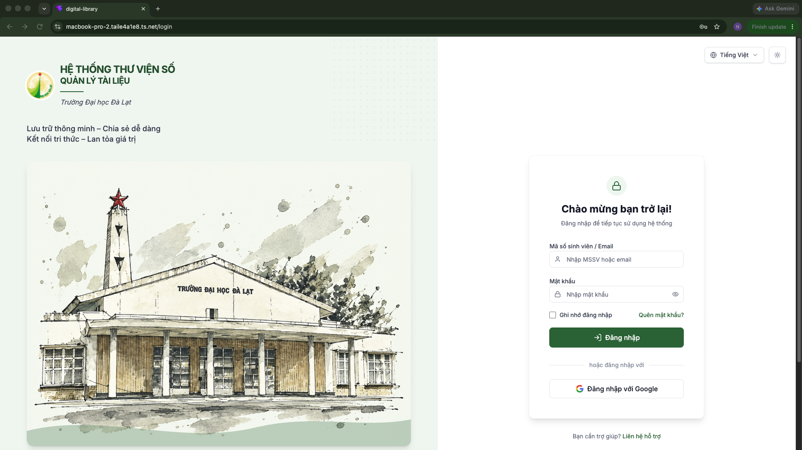

# 📚 BÁO CÁO DỰ ÁN: HỆ THỐNG THƯ VIỆN SỐ - QUẢN LÝ TÀI LIỆU HỌC TẬP

**Tên dự án:** Digital Library - Foundation Project  
**Kiến trúc:** Client - Server (RESTful API)  
**Ngày cập nhật:** 20/09/2026  
**Repository:** `Nguyen06-CSE/Foundation-Project`

---

## 📖 MỤC LỤC
1. [Giới thiệu tổng quan & Ý tưởng dự án](#1-gioi-thieu-tong-quan--y-tuong-du-an)
2. [Kiến trúc Hệ thống & Công nghệ sử dụng](#2-kien-truc-he-thong--cong-nghe-su-dung)
3. [Thiết kế Cơ sở dữ liệu PostgreSQL Nâng cao](#3-thiet-ke-co-so-du-lieu-postgresql-nang-cao)
4. [Báo cáo Chi tiết Chức năng & Minh họa Giao diện](#4-bao-cao-chi-tiet-chuc-nang--minh-hoa-giao-dien)
   - 4.1. [Xác thực & Quản lý Tài khoản](#41-xac-thuc--quan-ly-tai-khoan)
   - 4.2. [Kho Tài liệu Cá nhân (Personal Space)](#42-kho-tai-lieu-ca-nhan-personal-space)
   - 4.3. [Quản lý Folder & Hệ thống Tag Linh hoạt](#43-quan-ly-folder--he-thong-tag-linh-hoat)
   - 4.4. [Tìm kiếm Toàn văn (Full-Text Search)](#44-tim-kiem-toan-van-full-text-search)
   - 4.5. [Không gian Hợp tác Nhóm (Group Workspace)](#45-khong-gian-hop-tac-nhom-group-workspace)
   - 4.6. [Thùng rác & Cơ chế Khôi phục An toàn](#46-thung-rac--co-che-khoi-phuc-an-toan)
5. [Tài liệu liên kết & Link tham chiếu](#5-tai-lieu-lien-ket--link-tham-chieu)

---

## 1. GIỚI THIỆU TỔNG QUAN & Ý TƯỞNG DỰ ÁN

Hệ thống Thư viện số (Digital Library) được xây dựng nhằm giải quyết bài toán quản lý, lưu trữ, tìm kiếm và chia sẻ tài liệu học tập cho **Sinh viên, Giảng viên và Quản trị viên Khoa/Trường**.

### 💡 Nguyên tắc vận hành cốt lõi:
1. **Mô hình 5 Không gian:** Cá nhân, Nhóm, Lớp, Khoa, Trường.
2. **Cơ chế Nhân bản Độc lập (Copy-on-Share):** Khi tài liệu được chia sẻ hoặc lưu về kho cá nhân, hệ thống tự động tạo một bản sao độc lập. Người nhận có thể chỉnh sửa, gắn nhãn dán (tag) mà không ảnh hưởng tới bản gốc của người gửi.
3. **Triết lý Folder = Kệ sách quản lý Tag:** Folder trong hệ thống không phải là thư mục chứa file vật lý cứng, mà đóng vai trò như **một kệ sách gom nhóm danh sách các Tag**. Tài liệu gắn Tag tương ứng sẽ tự động xuất hiện trên "kệ sách" đó.
4. **Tự động hóa xử lý ảnh thành PDF (OCR Integration):** Đối với ảnh chụp bài giảng (slide PowerPoint, ảnh bảng), hệ thống tự động gộp các file ảnh thành 1 file PDF thống nhất ngay từ Frontend (sử dụng `jsPDF`), gửi xuống Backend chạy OCR trích xuất văn bản giúp tìm kiếm nhanh chóng.

---

## 2. KIẾN TRÚC HỆ THỐNG & CÔNG NGHỆ SỬ DỤNG

```text
React (Vite + TypeScript + TailwindCSS)
       │
       ▼ (Axios + JWT Bearer Token)
FastAPI RESTful Services
       │
       ├── Async SQLAlchemy ──► PostgreSQL Database (Full-Text Search + GIN Index)
       ├── BackgroundTasks   ──► OCR Extraction, Merge PDF, Thumbnail Generator
       └── APScheduler       ──► Auto Clean Trash (30 days), Dissolve Group (24h)
```

- **Frontend:** React 18, TypeScript, Vite, TailwindCSS, TanStack Query (React Query), Zustand Store, Lucide Icons, jsPDF.  
- **Backend:** Python FastAPI, Pydantic v2, Async SQLAlchemy 2.0, Alembic Migrations, APScheduler, Tesseract OCR.  
- **Database:** PostgreSQL (bắt buộc) sử dụng các Extensions `unaccent`, `pg_trgm`, `tsvector`, `GIN Index`.  

---

## 3. THIẾT KẾ CƠ SỞ DỮ LIỆU POSTGRESQL NÂNG CAO

Dự án tận dụng tối đa sức mạnh chuyên sâu của PostgreSQL để xử lý dữ liệu lớn:  

- **Full-text search Tiếng Việt:** Kết hợp `unaccent` (bỏ dấu) + `pg_trgm` (tìm kiếm mờ Trigram) + `tsvector`.  
- **Trigger Tự động:** Tạo Trigger PL/pgSQL tự động tổng hợp title, description, và content (nội dung OCR) thành vector tìm kiếm `search_vector` mỗi khi có thao tác INSERT/UPDATE.  
- **Tối ưu tốc độ:** Đánh chỉ mục `GIN Index` trên `search_vector`, `username`, `email`, và `student_code`.  
- **JSONB Storage:** Cột `metadata_` kiểu JSONB cho phép lưu linh hoạt tác giả, số trang, năm xuất bản.  
- **Tối ưu truy vấn:** Sử dụng kỹ thuật `selectinload` và `joinedload` trong Async SQLAlchemy để tránh lỗi N+1 Query và MissingGreenlet.  

---

## 4. BÁO CÁO CHI TIẾT CHỨC NĂNG & MINH HỌA GIAO DIỆN

### 4.1. Xác thực & Quản lý Tài khoản

#### 🔑 Trang Đăng nhập & Đăng ký
- **Chức năng:** Cho phép Sinh viên/Giảng viên đăng nhập bằng MSSV, Username hoặc Email. Hệ thống cấp JWT Access Token và tự động điều hướng.  
- **Bảo vệ Route:** Tự động khôi phục phiên làm việc (Restore Session) khi ấn F5 thông qua endpoint `/auth/me`.  

#### ⚙️ Trang Cài đặt Tài khoản
- **Chức năng:** Xem thông tin cá nhân, cập nhật họ tên, MSSV, thay đổi mật khẩu an toàn.  
.png)
.png)
.png)
---

### 4.2. Kho Tài liệu Cá nhân (Personal Space)
.png)


#### 📊 Bảng điều khiển (Personal Dashboard)
- **Chức năng:** Thống kê tổng số tài liệu, dung lượng đã sử dụng, biểu đồ tròn phân bổ nhãn dán (Tag Distribution) và danh sách tài liệu gần đây.  

#### 📁 Màn hình Quản lý Tài liệu
- **Chức năng:** Hiển thị danh sách tài liệu dạng Lưới (Grid Card) hoặc Dòng (Row List). Tích hợp thanh lọc theo loại file (PDF, Word, PPTX, Ảnh...) và phân trang chuẩn.  
.png)

#### 📤 Modal Upload Tài liệu (Gộp nhiều ảnh thành PDF)
- **Chức năng:** Kéo thả file upload. Khi sinh viên chụp nhiều ảnh slide bài giảng, Frontend (`jsPDF`) tự động gộp các ảnh thành 1 file PDF duy nhất trước khi gửi API. Kiểm tra SHA-256 chống upload trùng.  

- **TÌM KIẾM:**
----
.png)
.png)
.png)
.png)
.png)
.png)
- **UPLOAD:**
----
----
.png)
.png)
.png)
.png)


#### 👁️ Màn hình Chi tiết Tài liệu & Xem trước (Document Detail)
- **Chức năng:**
  - Xem trực tiếp file PDF/Ảnh trên trình duyệt.  
  - Tab Nội dung OCR: Hiển thị toàn bộ văn bản được máy trích xuất từ file scan/ảnh.  
  - Ghi chú cá nhân, xem lịch sử phiên bản, chuyển đổi chế độ "Mở trong thẻ mới".  
.png)
.png)
.png)
.png)
.png)
.png)
.png)
.png)
.png)
.png)
.png)
---

### 4.3. Quản lý Folder & Hệ thống Tag Linh hoạt

> **Lưu ý thiết kế:** Trong hệ thống, Folder đóng vai trò như kệ sách chứa danh sách các Tag. Khi tạo Folder, người dùng chọn các Tag muốn quản lý. Tài liệu mang Tag đó sẽ tự động thuộc về Folder.

#### 🏷️ Tạo Folder & Gắn Tag
- **Chức năng:** Tạo Folder mới, chọn màu đại diện, chọn từ danh sách Tag có sẵn hoặc khởi tạo Tag mới ngay lập tức. Hệ thống tự khởi tạo 4 Folder mặc định: Giáo trình, Bài tập, Tài liệu tham khảo, Đồ án tốt nghiệp.  
.png)
.png)
.png)
.png)

---

### 4.4. Tìm kiếm Toàn văn (Full-Text Search)

#### 🔍 Lọc & Tìm kiếm Nâng cao
- **Chức năng:** Tìm kiếm tức thì theo từ khóa Tiếng Việt có dấu/không dấu. Bộ lọc đa tầng kết hợp: Loại tài liệu + Thẻ Tag + Khoảng thời gian.  
.png)
.png)
.png)
.png)
#### 🔎 Tìm kiếm Chuyên sâu trong Kho
- **Chức năng:** Hệ thống tìm trong cả tiêu đề, mô tả và nội dung sâu bên trong file nhờ chỉ mục `tsvector` PostgreSQL.  
.png)
.png)
---

### 4.5. Không gian Hợp tác Nhóm (Group Workspace)

#### 👥 Màn hình Quản lý Nhóm & Mời Thành viên
- **Chức năng:** Tạo nhóm học tập, đặt phân quyền mặc định (Chỉ xem hoặc Toàn quyền). Mời hàng loạt thành viên qua chuỗi MSSV/Email.  
- **Thẻ Tài liệu Nhóm:** Hiển thị rõ Thông tin Người tải lên (Avatar + Tên) ngay trên thẻ tài liệu.
.png)
.png)
.png)
.png)
.png)
.png)
.png)
.png)
.png)
.png)
.png)
.png)
.png)
.png)
.png)
.png)
.png)
.png)
.png)
.png)
.png)
.png)
.png)
.png)

---

### 4.6. Thùng rác & Cơ chế Khôi phục An toàn

#### 🗑️ Thùng rác (Trash Management)
- **Soft Delete:** File bị xóa chuyển sang trạng thái `is_deleted = true`.  
- **Đếm ngược xóa vĩnh viễn:** Tự động dọn dẹp sau 30 ngày qua background job APScheduler.  
- **Phân loại nguồn gốc:** Hiển thị rõ tài liệu xóa từ kho Cá nhân hay từ Nhóm bị giải tán.

---

## 5. TÀI LIỆU LIÊN KẾT & LINK THAM CHIẾU

- **Thư mục tài nguyên CSDL trong dự án:** `docs/sql/DB_ELibrary.sql`